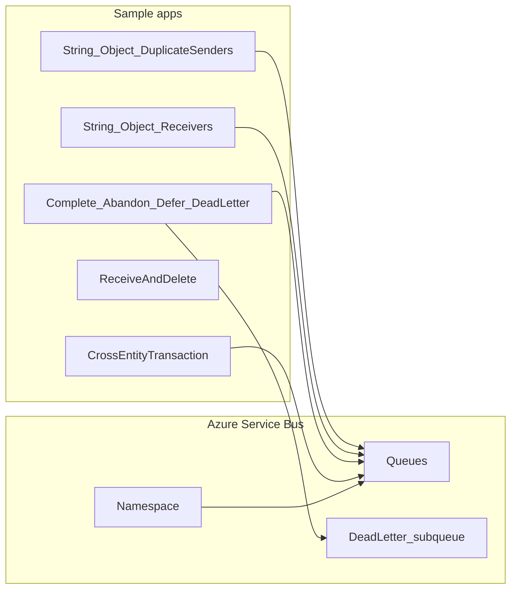

# Microsoft Azure Service Bus — Learning Guide

Hands-on C# console samples for learning **Azure Service Bus queues** with the modern [`Azure.Messaging.ServiceBus`](https://www.nuget.org/packages/Azure.Messaging.ServiceBus) SDK. Each project focuses on one concept so you can run, observe behavior in the Azure Portal, and build mental models for production messaging.

**Solution:** [src/microsoft-azure-service-bus.slnx](src/microsoft-azure-service-bus.slnx)

## What you will learn

- Send and receive messages (string and JSON payloads)
- **PeekLock** settlement: complete, abandon, defer, dead-letter
- **ReceiveAndDelete** vs PeekLock
- **Duplicate detection** using `MessageId`
- **Cross-entity transactions** across multiple queues

## Prerequisites

- An [Azure subscription](https://azure.microsoft.com/free/)
- [.NET 10 SDK](https://dotnet.microsoft.com/download)
- Visual Studio 2022+, VS Code, or any editor with the .NET CLI

All samples target **.NET 10.0** and use **Azure.Messaging.ServiceBus 7.20.2** (Object samples also use **Newtonsoft.Json**).

## Azure Service Bus essentials

| Term | Meaning |
|------|---------|
| **Namespace** | Container for queues (and topics in other scenarios). |
| **Queue** | Point-to-point messaging; one consumer typically processes each message. |
| **Connection string** | Endpoint + shared access key used by the samples (labs only; prefer managed identity in production). |
| **PeekLock** (default) | Message is locked when received. You must **Complete**, **Abandon**, **Defer**, or **DeadLetter** it, or it becomes visible again after the lock expires. |
| **ReceiveAndDelete** | Message is removed from the queue as soon as it is received—no settlement step. |
| **Dead-letter queue (DLQ)** | Subqueue for messages that could not be processed or were explicitly dead-lettered. |
| **Duplicate detection** | When enabled on a queue, Service Bus suppresses duplicate publishes with the same **MessageId** within a configured time window. |



## Azure Portal setup (step by step)

Use **Standard** tier for the namespace if you plan to run **duplicate detection** and **cross-entity transaction** labs. Basic tier does not support duplicate detection; transaction behavior also requires an appropriate tier/configuration.

### 1. Create a Service Bus namespace

1. Sign in to the [Azure Portal](https://portal.azure.com).
2. **Create a resource** → search **Service Bus** → **Create**.
3. Choose subscription, resource group, **Namespace name** (globally unique), and **Pricing tier: Standard** (recommended for full lab coverage).
4. Review and **Create**. Wait until deployment completes.

### 2. Create queues for most labs

1. Open your namespace → **Entities** → **Queues** → **+ Queue**.
2. Create a queue, for example **`training-queue`**.
3. Optional but useful for settlement labs:
   - **Lock duration** — default is fine; note it for abandon/complete timing.
   - **Max delivery count** — after this many failed deliveries, messages can move to the DLQ automatically.

Use **`training-queue`** (or your name) as `queueName` in sample code unless noted below.

### 3. Queue with duplicate detection

For [DuplicateMessageDetection](src/DuplicateMessageDetection/ServiceBussSender/Program.cs):

1. **+ Queue** → name e.g. **`training-queue-dedup`**.
2. Enable **Duplicate detection** → set **History window** (e.g. 10 minutes).
3. Use this queue name in that project’s `queueName`.

### 4. Three queues for transactions

For [CrossEntityTransaction](src/CrossEntityTransaction/ServiceBusTransaction/Program.cs), create three queues named exactly:

- `queue_1`
- `queue_2`
- `queue_3`

(Names match the constants in `Program.cs`.)

### 5. Get the connection string

1. Namespace → **Settings** → **Shared access policies**.
2. Open **RootManageSharedAccessKey** (fine for learning; use least-privilege policies or **Azure AD / managed identity** in production).
3. Copy **Primary connection string**.

### 6. Configure each sample

In each project’s `Program.cs`, set:

```csharp
string connectionString = "<your-primary-connection-string>";
string queueName = "<your-queue-name>";
```

**Never commit connection strings to git.** This repo gitignores `.env`; keep secrets local only.

### 7. Seed messages when needed

Receiver-only projects expect a message already on the queue. Run the matching **sender** first (e.g. `ServiceBusSender` before `ServiceBusReceiver`), or send a test message from the Portal (**Service Bus Explorer** on the queue → **Send**).

---

## Quick reference: client, sender, receiver

Pattern used across most projects ([String/ServiceBusSender/Program.cs](src/String/ServiceBusSender/Program.cs)):

```csharp
using Azure.Messaging.ServiceBus;

string connectionString = "<connection-string>";
string queueName = "<queue-name>";

await using ServiceBusClient client = new(connectionString);
ServiceBusSender sender = client.CreateSender(queueName);

await sender.SendMessageAsync(new ServiceBusMessage("Hello from C#"));
Console.WriteLine("Message has been sent");
```

Receiving (PeekLock by default):

```csharp
ServiceBusReceiver receiver = client.CreateReceiver(queueName);
ServiceBusReceivedMessage msg = await receiver.ReceiveMessageAsync();
// await receiver.CompleteMessageAsync(msg); // when processing succeeds
```

---

## Recommended learning path

Run projects in this order. Use `dotnet run` from the repository root:

```powershell
dotnet run --project src/String/ServiceBusSender/ServiceBusSender.csproj
dotnet run --project src/String/ServiceBusReceiver/ServiceBusReceiver.csproj
```

| Step | Project | Path | Concept |
|------|---------|------|---------|
| 1 | ServiceBusSender | [src/String/ServiceBusSender](src/String/ServiceBusSender/Program.cs) | Create client and sender; send a string message. |
| 2 | ServiceBusReceiver | [src/String/ServiceBusReceiver](src/String/ServiceBusReceiver/Program.cs) | Receive one message. **Note:** this sample does not call `CompleteMessageAsync`, so the message will become available again after the lock expires—useful to see PeekLock behavior. |
| 3 | ServiceBusObjectSender | [src/Object/ServiceBusObjectSender](src/Object/ServiceBusObjectSender/Program.cs) | Serialize an `Employee` object to JSON and send bytes. |
| 4 | ServiceBusObjectReceiver | [src/Object/ServiceBusObjectReceiver](src/Object/ServiceBusObjectReceiver/Program.cs) | Deserialize JSON back to `Employee`. |
| 5 | ServiceBusCompleteReceiver | [src/Complete/ServiceBusCompleteReceiver](src/Complete/ServiceBusCompleteReceiver/Program.cs) | **Complete** — remove message from queue after successful handling. |
| 6 | ServiceBusAbandonReceiver | [src/Abandon/ServiceBusAbandonReceiver](src/Abandon/ServiceBusAbandonReceiver/Program.cs) | **Abandon** — release lock and return message for retry. |
| 7 | ServiceBusReceiveAndDeleteReceiver | [src/ReceiveAndDelete/ServiceBusReceiveAndDeleteReceiver](src/ReceiveAndDelete/ServiceBusReceiveAndDeleteReceiver/Program.cs) | Compare explicit **PeekLock** receiver vs **ReceiveAndDelete**. |
| 8 | ServiceBusDeferralReceiver | [src/Deferral/ServiceBusDeferralReceiver](src/Deferral/ServiceBusDeferralReceiver/Program.cs) | **Defer** for later processing; **ReceiveDeferredMessageAsync** by sequence number. |
| 9 | ServiceBusDeadLetterMessage | [src/DeadLetter/ServiceBusDeadLetterMessage](src/DeadLetter/ServiceBusDeadLetterMessage/Program.cs) | **DeadLetterMessageAsync** then read from DLQ via `SubQueue.DeadLetter`. |
| 10 | ServiceBussSender | [src/DuplicateMessageDetection/ServiceBussSender](src/DuplicateMessageDetection/ServiceBussSender/Program.cs) | Same body with/without shared **MessageId** when duplicate detection is enabled. |
| 11 | ServiceBusTransaction | [src/CrossEntityTransaction/ServiceBusTransaction](src/CrossEntityTransaction/ServiceBusTransaction/Program.cs) | **TransactionScope** + `EnableCrossEntityTransactions`: send to `queue_2` and `queue_3`, complete on `queue_1`. |

---

## Module reference

### String — basic send and receive

| | |
|--|--|
| **Send** | `ServiceBusClient`, `ServiceBusSender`, `ServiceBusMessage` |
| **Receive** | `ServiceBusReceiver`, `ReceiveMessageAsync` |
| **Try this** | After receive without complete, watch **Active message count** and lock behavior in the Portal. |

### Object — JSON payloads

| | |
|--|--|
| **Send** | `JsonConvert.SerializeObject`, message body as UTF-8 bytes |
| **Receive** | `msg.Body.ToString()`, `DeserializeObject<Employee>` |
| **Model** | [Employee.cs](src/Object/ServiceBusObjectSender/Employee.cs) |

### Complete — successful settlement

Calls `CompleteMessageAsync` after receive so the message is permanently removed from the queue.

### Abandon — retry

Calls `AbandonMessageAsync` so the message is unlocked and can be delivered again (delivery count increases).

### ReceiveAndDelete — receive modes

Creates receivers with `ServiceBusReceiverOptions`:

- `ReceiveMode = ServiceBusReceiveMode.PeekLock` — message stays until settled.
- `ReceiveMode = ServiceBusReceiveMode.ReceiveAndDelete` — message deleted on receive.

Run twice with messages on the queue to compare counts.

### Deferral — process later

1. Receive a message.
2. `DeferMessageAsync(msg)` — removes from active queue but keeps it in the entity; remember **`msg.SequenceNumber`**.
3. `ReceiveDeferredMessageAsync(sequenceNumber)` — retrieve deferred message.

The sample uses a placeholder sequence number (`16`). After deferring, replace it with the **actual** `msg.SequenceNumber` from the message you deferred.

### Dead letter — poison messages and DLQ

1. `DeadLetterMessageAsync(msg)` moves the message to the dead-letter subqueue.
2. Create a receiver with `SubQueue = SubQueue.DeadLetter` on the same queue name to read from the DLQ.

Also explore automatic dead-lettering via **max delivery count** on the queue.

### Duplicate message detection

Sends two pairs of messages:

1. Same content, **no** `MessageId` → two distinct messages (when duplicate detection is off or irrelevant).
2. Same content, **same** `MessageId` (`"123456"`) → only one stored when duplicate detection is **enabled** on the queue.

Verify in Portal or Service Bus Explorer message counts.

### Cross-entity transaction

Requires:

- `ServiceBusClientOptions { EnableCrossEntityTransactions = true }`
- `System.Transactions.TransactionScope` with `TransactionScopeAsyncFlowOption.Enabled`

Flow:

1. Place a message on **`queue_1`** (send manually or a small sender).
2. Receive from `queue_1`, send copies to `queue_2` and `queue_3`, then complete the `queue_1` message inside the scope.
3. Call `trn.Complete()` to commit; omit it to observe rollback behavior.

Queue names in code: `queue_1`, `queue_2`, `queue_3`.

---

## Troubleshooting

| Symptom | Likely cause |
|---------|----------------|
| Receive hangs or times out | No message on the queue, wrong queue name, or wrong namespace connection string. |
| Message reappears after receive | PeekLock without **Complete** (by design in the basic String receiver). |
| Duplicate detection seems ignored | Queue not created with duplicate detection, or wrong tier (use **Standard**). |
| Defer fails / wrong message | `ReceiveDeferredMessageAsync` given wrong sequence number; use `msg.SequenceNumber` after defer. |
| Transaction does not commit | Exception inside scope, `Complete()` not called, cross-entity not enabled, or tier limitation. |
| DLQ receive empty | Dead-letter step did not run first, or reading wrong queue/subqueue. |

---

## Repository layout

```
src/
├── String/                    # Send & receive string messages
├── Object/                    # JSON Employee payload
├── Complete/                  # CompleteMessageAsync
├── Abandon/                   # AbandonMessageAsync
├── ReceiveAndDelete/          # PeekLock vs ReceiveAndDelete
├── Deferral/                  # Defer + receive deferred
├── DeadLetter/                # Dead-letter + DLQ reader
├── DuplicateMessageDetection/ # MessageId deduplication
└── CrossEntityTransaction/    # TransactionScope across queues
```

---

## Further reading

- [Service Bus messaging overview](https://learn.microsoft.com/azure/service-bus-messaging/service-bus-messaging-overview)
- [Queues, topics, and subscriptions](https://learn.microsoft.com/azure/service-bus-messaging/service-bus-queues-topics-subscriptions)
- [Get started with Service Bus queues in .NET](https://learn.microsoft.com/azure/service-bus-messaging/service-bus-dotnet-get-started-with-queues)
- [Message duplication detection](https://learn.microsoft.com/azure/service-bus-messaging/duplicate-detection)
- [Service Bus transactions](https://learn.microsoft.com/azure/service-bus-messaging/service-bus-transactions)

## License

MIT — see [LICENSE](LICENSE).
